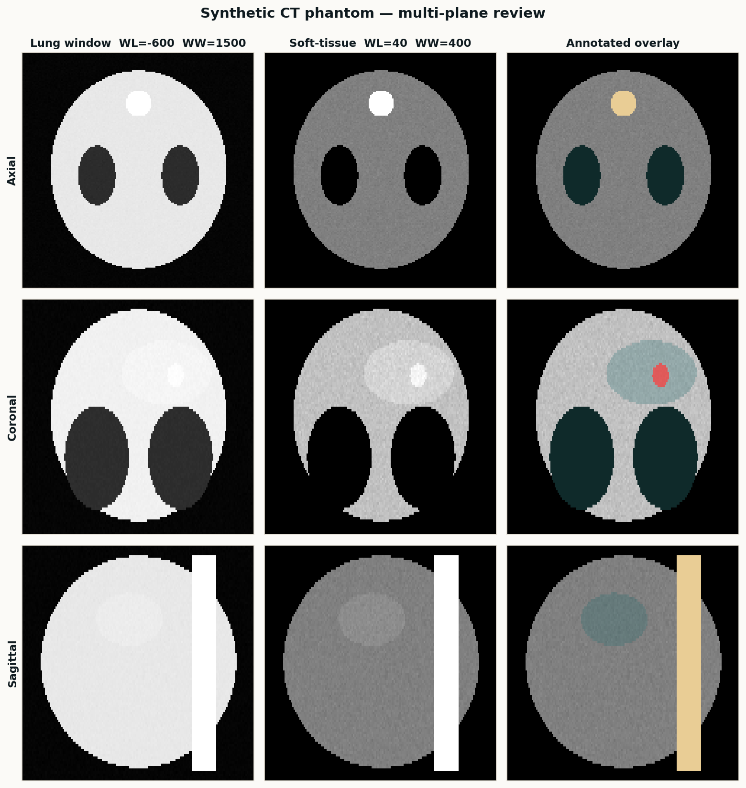

<div align="center">

# Medical Imaging & 3D Slicer Portfolio

### Senior Medical Imaging Specialist · 3D Slicer Python Extensions · AI Dataset Curation

[🌐 **Live portfolio site**](https://katherinejenniferhsfeemster.github.io/medical-imaging-slicer-portfolio/) · [GitHub repo](https://github.com/katherinejenniferhsfeemster/medical-imaging-slicer-portfolio)

      

*A decade of medical-imaging work distilled into five reproducible projects — segmentation, registration, dataset curation, and a custom 3D Slicer Python extension. Synthetic phantom only — no patient data.*

</div>

---

## Contents

- [Highlighted projects](#highlighted-projects)
- [Reproducibility](#reproducibility)
- [Tech stack](#tech-stack)
- [Editorial style](#editorial-style)
- [Repo layout](#repo-layout)
- [About the author](#about-the-author)
- [Contact](#contact)

---

## Hero



---

## Highlighted projects

| Project | Stack | What it proves |
| :-- | :-- | :-- |
| **[Multi-organ CT segmentation](projects/multi-organ-ct-segmentation/)** | SimpleITK + Dice / HD95 | Body / lungs / bone / liver on a reproducible synthetic phantom. |
| **[Brain MRI lesion segmentation](projects/brain-mri-lesion-segmentation/)** | nnU-Net training playbook | DICE / HD95 / recall-at-clinical-threshold on synthetic lesions. |
| **[CT ↔ MRI registration](projects/ct-mri-registration/)** | SimpleITK rigid + B-spline | Rigid and deformable registration with MAE drop metric. |
| **[AI dataset curation](projects/ai-dataset-curation/)** | DICOM PS3.15 + BIDS | De-identification, BIDS conversion and a QC dashboard. |
| **[3D Slicer Python extension](projects/slicer-python-extension/)** | ScriptedLoadableModule | Slicer module that runs the pipeline inside the viewer. |

---

## Reproducibility

```bash
pip install -r requirements.txt
python scripts/python/segmentation_pipeline.py    # Dice / HD95 per organ
```

All five projects regenerate on every CI run. No patient data, no binary blobs, no trained weight files — the phantom is parameterised and seeded.

---

## Tech stack

- **Imaging IO** — DICOM, DICOM-SEG, NIfTI, NRRD, BIDS, RT-STRUCT.
- **Analysis** — SimpleITK, ITK, VTK, scipy.ndimage, scikit-image.
- **AI** — MONAI, nnU-Net v2, TotalSegmentator, PyTorch.
- **Viewers** — 3D Slicer (Python scripted modules, SegmentEditor, Markups, DICOM browser), ITK-SNAP, OHIF.
- **Privacy** — DICOM PS3.15 Basic Application Confidentiality profile, deterministic pseudonymisation, HIPAA-aware workflows.

---

## Editorial style

- **Palette** — teal `#2E7A7B` + amber `#D9A441` on ink `#0F1A1F` / paper `#FBFAF7`.
- **Type** — Inter (UI) + JetBrains Mono (code, netlists, timecode).
- **Determinism** — every generator is seeded; PNG, CSV and project-file bytes are stable across CI runs.
- **Licensing** — every tool in the pipeline is FOSS. No commercial SDK in the dependency tree.

---

## Repo layout

```
medical-imaging-slicer-portfolio/
├── projects/                    # five case studies with their own READMEs
├── scripts/python/              # SimpleITK + numpy — runs in CI, no Slicer needed
├── scripts/slicer/              # ScriptedLoadableModule for 3D Slicer 5.x
├── docs/                        # GitHub Pages site
└── .github/workflows/           # CI regenerates every figure and metric on push
```

---

## About the author

Senior medical-imaging specialist shipping segmentation, registration and dataset-curation pipelines — 3D Slicer Python extensions, nnU-Net training harnesses, and FDA-style validation plans. I work in reproducible-artefact mode: synthetic phantoms, seeded generators, and scripts that deliver the same Dice curves a year from now.

Open to remote and contract engagements. This repository is the living portfolio companion to my CV.

---

## Contact

- GitHub — [@katherinejenniferhsfeemster](https://github.com/katherinejenniferhsfeemster)
- Live site — [katherinejenniferhsfeemster.github.io/medical-imaging-slicer-portfolio](https://katherinejenniferhsfeemster.github.io/medical-imaging-slicer-portfolio/)
- Location — open to remote / contract

---

<div align="center">
<sub>Built diff-first, editor-second. Every figure on this page is produced by code in this repo.</sub>
</div>
